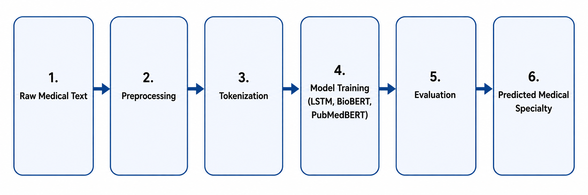
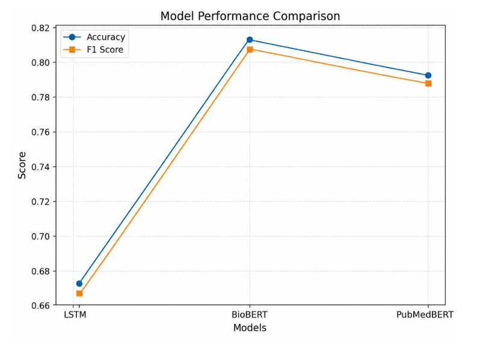
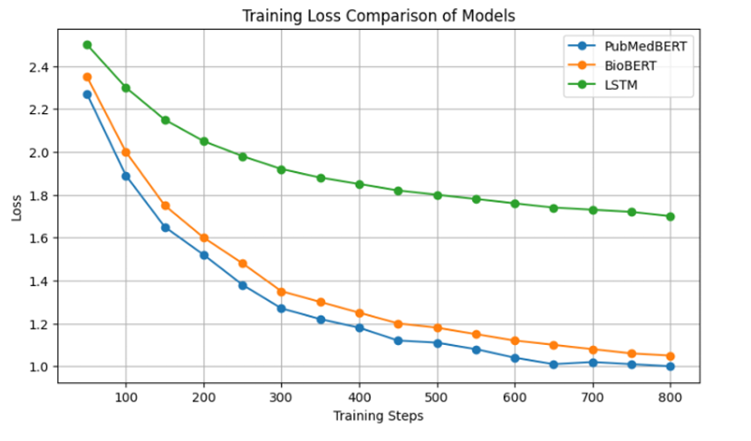
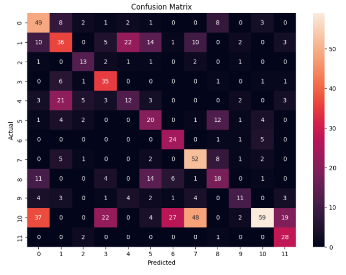
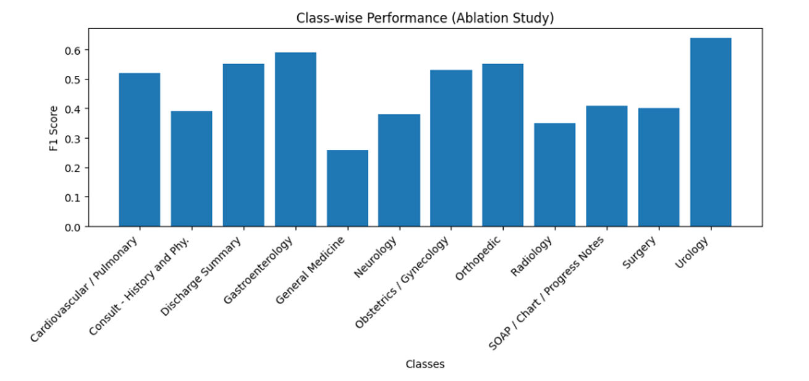

# Biomedical NLP for Medical Specialty Triage

A deep learning-powered biomedical NLP pipeline that classifies patient symptom descriptions and medical transcription text into the most relevant medical specialty, enabling faster and more consistent triage support.

---

## Problem Statement

Hospitals and healthcare systems receive large volumes of free-text patient complaints, symptom descriptions, and clinical notes. Routing a patient to the right specialty often depends on manually interpreting this text, which can be slow, inconsistent, and difficult to scale in high-pressure settings.

This project addresses that problem using **biomedical text classification**. Given a patient symptom description or medical transcription, the system predicts the most relevant medical specialty, such as **Cardiovascular / Pulmonary**, **Neurology**, **Orthopedic**, **Gastroenterology**, **Urology** and other specialty categories.

The goal is not to replace clinicians, but to demonstrate how deep learning and domain-specific NLP models can support faster triage workflows and reduce manual routing effort.

---

## Solution Overview

This repository implements an end-to-end deep learning pipeline for medical specialty prediction from clinical text.

The pipeline includes:

- Biomedical text cleaning and preprocessing
- Specialty label encoding and class filtering
- Word-level sequence modeling using LSTM
- Transformer fine-tuning using BioBERT and PubMedBERT
- Multi-class classification evaluation
- Confusion matrix and class-wise performance analysis
- Model comparison across accuracy, precision, recall, and F1-score

The project compares a traditional sequential deep learning baseline against transformer-based biomedical language models to evaluate how much domain-specific pretraining improves clinical text understanding.

---

## Models Implemented

### 1. LSTM Baseline

A TensorFlow/Keras-based sequence model used as the baseline architecture.

**Architecture components:**

- Word-level tokenization
- Embedding layer
- Bidirectional LSTM layer
- Dropout regularization
- Dense classification layers
- Softmax output for multi-class prediction

The LSTM baseline captures sequential patterns in text but has limited ability to model long-range context and domain-specific biomedical terminology.

---

### 2. BioBERT

BioBERT is a biomedical domain-adapted BERT model trained further on biomedical corpora. It is designed to capture contextual relationships in medical and scientific language more effectively than general-purpose BERT.

**Model used:**

```text
dmis-lab/biobert-base-cased-v1.1
```

**Why it matters:**

BioBERT is well-suited for clinical and biomedical NLP because it understands terms, abbreviations, and context patterns commonly found in medical text.

---

### 3. PubMedBERT

PubMedBERT is trained from scratch on biomedical literature, giving it a biomedical-specific vocabulary and representation space.

**Model used:**

```text
microsoft/BiomedNLP-PubMedBERT-base-uncased-abstract-fulltext
```

**Why it matters:**

PubMedBERT is useful for biomedical classification tasks because its tokenizer and learned representations are built specifically around biomedical language rather than general-domain text.

---

## Dataset

This project uses the publicly available **Medical Transcriptions Dataset** from Kaggle.

The main classification pipeline uses medical transcription text and corresponding medical specialty labels. After preprocessing and class filtering, the task is formulated as a **multi-class medical specialty classification problem** across 12 major specialty classes.

---

## Biomedical NLP Pipeline



---

## Preprocessing Pipeline

The preprocessing stage prepares noisy clinical text for deep learning models.

Key steps include:

- Removing missing or irrelevant transcription records
- Converting text to lowercase
- Removing punctuation, special characters, and unnecessary symbols
- Normalizing whitespace
- Filtering medical specialty classes with sufficient samples
- Encoding target labels using `LabelEncoder`
- Performing train-test split
- Applying stratification where supported

For the **LSTM model**, text is converted into padded integer sequences.

For **BioBERT** and **PubMedBERT**, text is encoded using Hugging Face tokenizers with fixed maximum sequence lengths.

---

## Training Configuration

| Model | Framework | Tokenization | Max Length | Optimizer | Learning Rate |
|---|---|---:|---:|---|---:|
| LSTM | TensorFlow / Keras | Word-level tokenizer | 200 | Adam | 1e-3 |
| BioBERT | PyTorch + Hugging Face | WordPiece tokenizer | 256 | Hugging Face Trainer / AdamW | 2e-5 |
| PubMedBERT | PyTorch + Hugging Face | Biomedical tokenizer | 384 | Hugging Face Trainer / AdamW | 2e-5 |

---

## Results

| Model | Accuracy | Precision | Recall | F1-Score |
|---|---:|---:|---:|---:|
| LSTM | 0.6738 | 0.67 | 0.67 | 0.67 |
| BioBERT | **0.8134** | **0.82** | **0.81** | **0.81** |
| PubMedBERT | 0.7425 | 0.75 | 0.74 | 0.70 |

BioBERT achieved the strongest overall performance, showing the advantage of biomedical domain-specific pretraining for medical specialty classification.

### Key Insights

- Transformer-based models outperform the LSTM baseline on all major metrics.
- BioBERT provides the best balance of accuracy, precision, recall, and F1-score.
- PubMedBERT remains competitive because of its biomedical vocabulary and domain-specific pretraining.
- LSTM learns useful sequence patterns but struggles with complex clinical context and overlapping specialty language.
- Most errors occur between specialties with similar symptoms or related clinical vocabulary.

---

## Visual Results

### 1. Model Performance Comparison



---

### 2. Training Loss Curves



---

### 3. Confusion Matrix



---

### 4. Class-wise Performance



---

## Sample Inference

Example input:

```text
Patient reports chest pain, shortness of breath, and discomfort while walking.
```

Expected output:

```text
Predicted Specialty: Cardiovascular / Pulmonary
```

The notebook includes preprocessing and model evaluation logic that can be extended into a reusable inference function for real-time prediction.

---

## Tech Stack

- Python
- Pandas
- NumPy
- Scikit-learn
- TensorFlow / Keras
- PyTorch
- Hugging Face Transformers
- Hugging Face Datasets
- Matplotlib
- Seaborn
- Kaggle API
- Google Colab

---

## Future Improvements

- Build a Streamlit or Gradio demo for interactive medical specialty prediction.
- Add explainability using SHAP, LIME, or attention-based visualizations.
- Improve handling of class imbalance using focal loss or advanced sampling strategies.
- Experiment with longer-context clinical transformer models.
- Package preprocessing and inference into reusable Python modules.
- Add model cards and dataset cards for better reproducibility.
- Evaluate on additional real-world clinical text datasets.

---

## Medical AI Disclaimer

This project is a machine learning prototype for biomedical text classification. It is intended for research, experimentation, and portfolio demonstration only. It should not be used for diagnosis, treatment decisions, or clinical deployment without proper validation, expert review, privacy safeguards, and regulatory compliance.

---

